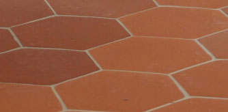
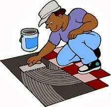
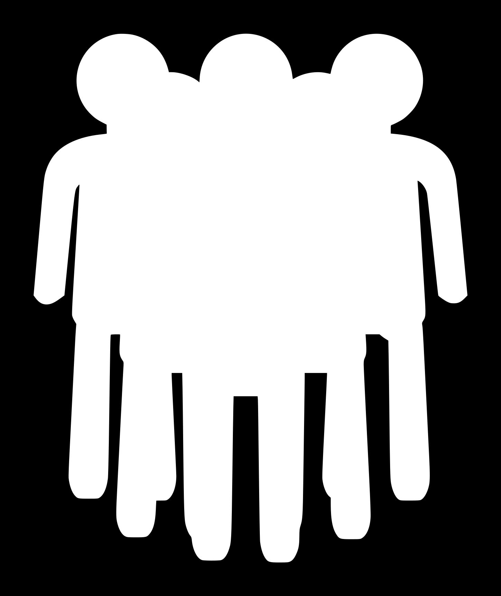

# Let's start with something else
### Tile the kitchen's floor

### 20 square meters to do

### But
- it needs to be done quickly
- you could:
    - pressure yourself
    - find someone else more skilled
    - find someone else more skilled and pressure him

### Or
- go parallel: hire 2 workers

- halve time needed

### Still not fast enough ?
- hire 20 workers

- be 20 times as fast ?

### No
- avoid stepping on each other's toes
- divide the work but
    - independant pieces
    - fast workers get larger pieces
